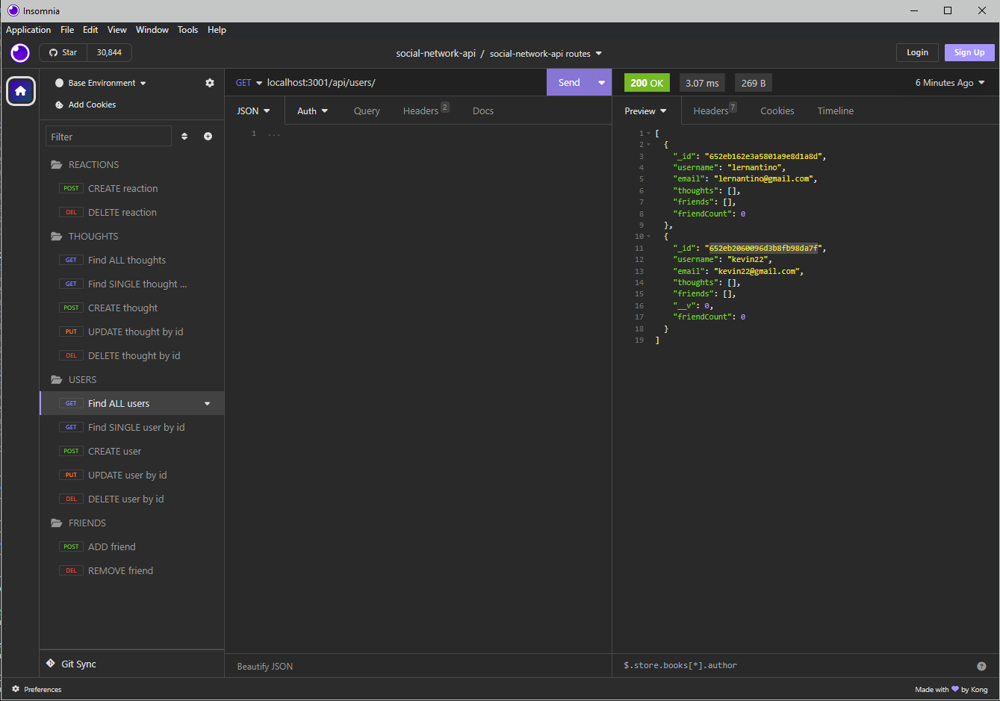

# Social Network API

M18 - This repo is a Social Network API that social networks can use for their users to share their thoughts, react to friends' thoughts and create friends lists.

## Description

The challenge is an Job-seeking coding assessment or take-home assignment (no starter code is provided, we will build this web application by scratch). The goal is to build an API for a social network web application where users can share their thoughts, react to friends’ thoughts, and create a friend list. I used Express.js for routing, a MongoDB database, and the Mongoose ODM. In addition to using the Express.js and Mongoose packages, I used moment.js to format date timestamps. I also used Insomnia Core to test the API routes.

The motivation behind this project is to create an API for a social network using the mentioned packages, tools, and technologies. The purpose of this project is to build the backend of a social network web application where users can share their thoughts, react to friends’ thoughts, and create a friend list. The user story and acceptance criteria are as follows:

## Accessing the Repo or Webpage:

- GitHub Repo URL: https://github.com/kevindimayuga/social-network-api-kd
- GitHub Pages WebPage Deployment URL: N/A
- Heroku Webpage Deployed URL: N/A

## Screenshots, GIFs and Videos

- Since we will be creating the backend of a social network web application , you can use the following [LINK](https://drive.google.com/file/d/12K71wVXamgkQZXdQyrVQW4lwk1iUr7mI/view) to access a video walkthrough on how to use API to test the routes for the social network.
    - [Social Network API Video Walkthrough](https://drive.google.com/file/d/12K71wVXamgkQZXdQyrVQW4lwk1iUr7mI/view)

#### Insomnia Testing:

## Table of Contents

- [Installation](#installation)
- [Usage](#usage)
- [Credits](#credits)
- [License](#license)
- [Badges](#badges)
- [Features](#features)
- [Contributions](#contributions)
- [Tests](#tests)
- [Contacts](#Contacts)

## Installation

The following steps were taken to complete the project:
- Review the purpose of the project, the user story and acceptance criteria
- Review the basics to starting a command-line application
- Review JavaScript, Node.js, Express.js, MongoDB, Mongoose, Moment.js, Insomnia Core
- Create Professional README file
- Write code
- Add website image/gif to README file
- Add link to video walkthrough on how to use README generator command-line application
- Submit URL to GitHub Repo and link to video walkthrough

## Usage

- Clone repo onto local device
- Open repo in local CLI
- Make sure node packages are installed by running `npm i`
    - `express`, `moment`, `mongoose`, `nodemon` and `validator` need to be installed within the package.json
- Run `npm run seed` in CLI to seed data
- Run `npm run start` in CLI to start server
- Test all routes using `Insomnia`

## Credits

I used the following resources to help guide me to complete the portfolio project:

- [MDN](https://developer.mozilla.org/en-US/)
- [W3Schools](https://www.w3schools.com/)
- [Professional README Guide](https://coding-boot-camp.github.io/full-stack/github/professional-readme-guide)
- [Node.js Introduction](https://www.w3schools.com/nodejs/nodejs_intro.asp)
- [Mongoose](https://www.npmjs.com/package/mongoose)
- [MongoDB](https://www.mongodb.com/)
- [Express.js](https://www.npmjs.com/package/express)
- [Validator.js](https://www.npmjs.com/package/validator)
- [Moment.js](https://www.npmjs.com/package/moment)
- [Nodemon](https://www.npmjs.com/package/nodemon)
- [Insomnia Core](https://insomnia.rest/products/insomnia)
- [How to take a full page screenshot with a hidden Chrome shortcut](https://zapier.com/blog/full-page-screenshots-in-chrome/)

I referred back to Module 18: NoSQL to review activities and the mini project to help me complete the code necessary for this project.

## License

- [MIT](https://opensource.org/license/mit/)

## Badges

## Features

N/A

## Contributions

N/A

## Tests

N/A

## Contacts

